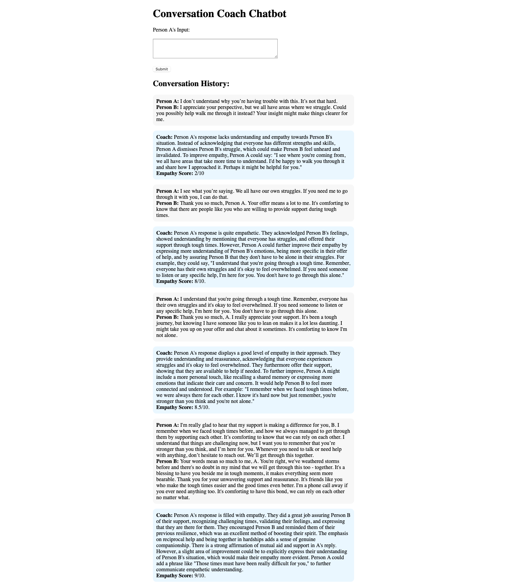

# Empathy-Coach

The app simulates conversations between a user (Person A) and another character (Person B). The conversation coach evaluates the user’s input and provides feedback to help improve empathy in their responses.

